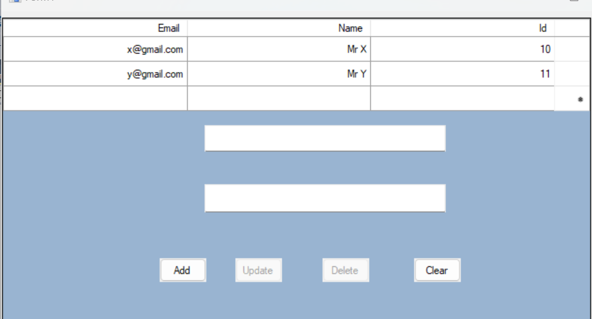

# Windows Forms CRUD Application

This is a simple Windows Forms application demonstrating basic CRUD (Create, Read, Update, Delete) operations using C# and .NET Framework.

## Features
- Add new person records
- View all records in a grid
- Update existing records
- Delete records
- Data persistence using a repository pattern

## Project Structure
- `Form1.cs`: Main form with UI and CRUD logic
- `Person.cs`: Model class representing a person
- `PersonRepository.cs`: Handles data storage and operations
- `crud.png`: Screenshot of the application UI

## Prerequisites
- Visual Studio 2015 or later
- .NET Framework 4.6.2 or compatible

## Getting Started
1. Clone or download this repository.
2. Open `WindowsFormsApplication1.sln` in Visual Studio.
3. Restore NuGet packages if prompted.
4. Build and run the solution.

## Screenshot

## License
This project is for educational purposes.
